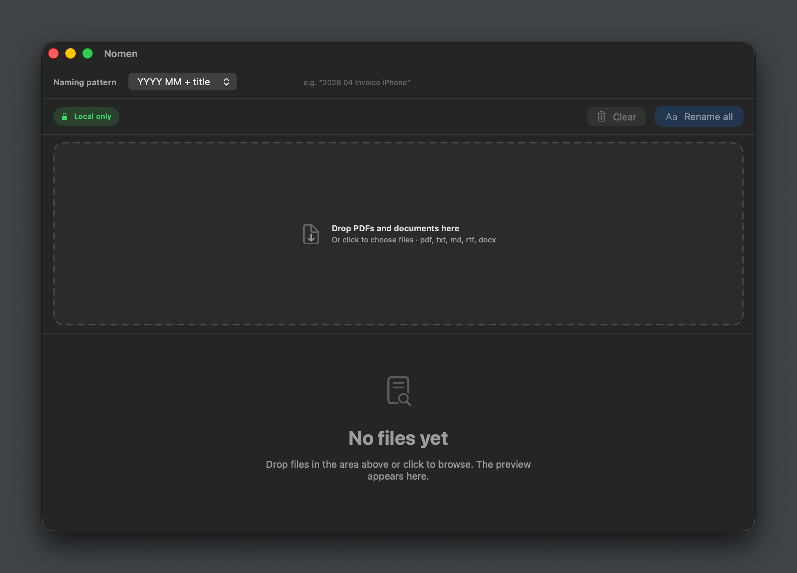
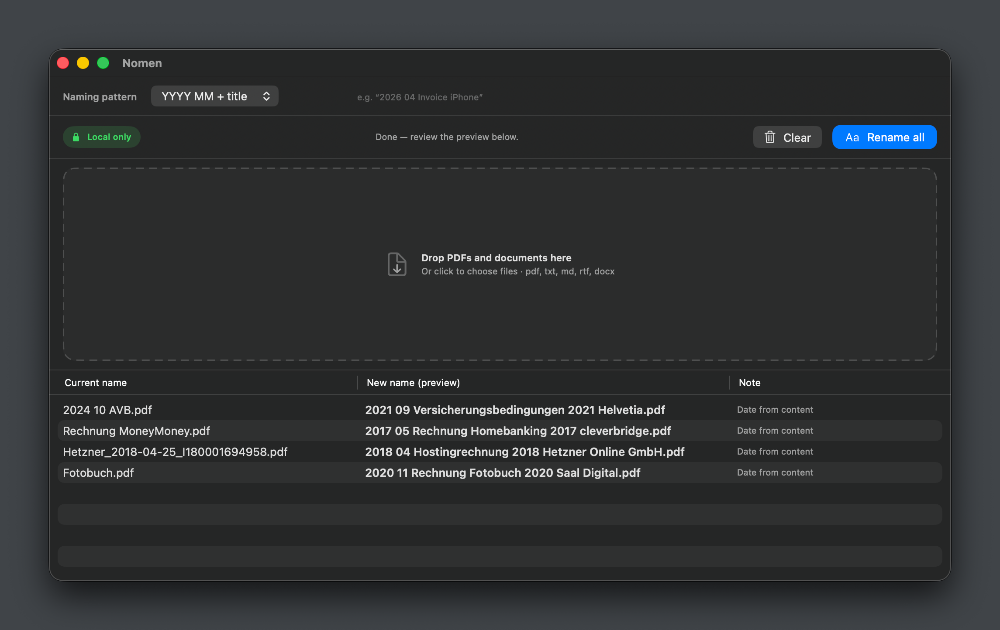
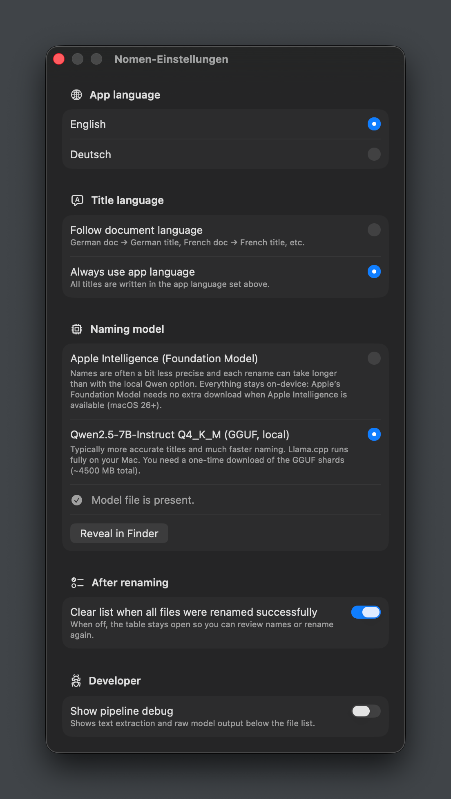

# Nomen App

Nomen is a native macOS app that suggests **archive-style file names** for documents using on-device AI. It reads supported files, extracts text (including OCR for scanned PDFs), proposes a structured title and date, and lets you preview and apply renames in bulk.

## Why This App

Personal and office folders often accumulate opaque names like `scan_2024.pdf`. Nomen turns document content into **consistent, human-readable names** (for example `2025 03 Electricity bill 2024 UtilityCo.pdf`) while keeping processing **local**—either via Apple’s on-device language model where supported, or via an optional local GGUF model.

## Core Features

- **AI-assisted naming**
  - Proposes a document date and an archive title following a fixed structure (document type, topic, year, issuer).
  - **Apple Intelligence / Foundation Models** backend when the OS and SDK support it (see Requirements).
  - **Local Qwen 2.5 7B Instruct (GGUF)** backend via [llama.swift](https://github.com/mattt/llama.swift) for fully offline naming after a one-time model download (~4.5 GB, two shards from Hugging Face).
- **Supported formats**
  - PDF (embedded text; **Vision OCR on the first page** when text is too sparse—typical for scans)
  - Plain text: `txt`, `md`, `markdown`, `csv`, `log`
  - `rtf` / `rtfd`
  - `docx` (via ZIP/text extraction)
- **Filename patterns**
  - `YYYY MM Title`
  - `YYMMDD Title`
  - Title only
  - Filesystem-safe slugging and redundant date stripping when the title already echoes the schema prefix
- **Workflow**
  - Drag-and-drop or add files, live preview table, selective rename
  - Optional **pipeline debug** panel for troubleshooting
  - **Quick Look** integration for inspection
  - Onboarding for first-time setup (including model choice)
- **Localization**
  - UI: English and German
  - Generated title language: follow document heuristics or match app language
- **Settings**
  - Naming backend, title language, clear list after rename, developer debug toggles

## Screenshots



*Main window: naming pattern, local-only indicator, drop zone, and preview area.*



*After analysis: original names vs. proposed archive-style names in the preview table.*



*Settings: app and title language, Apple Intelligence vs. local Qwen GGUF, and workflow toggles.*

## Safety & Data Handling

- Text extraction and inference are designed to run **on your Mac** (Apple backend or bundled llama runtime)—not sent to a custom third-party server by the app.
- The optional GGUF weights are downloaded from **Hugging Face** when you choose that backend; verify network and disk space before downloading.
- **Always preview** renames on copies or backups first, especially for large batches or network volumes.

## Requirements

- **macOS 14+** (Swift package platform)
- **Swift 6** toolchain / Xcode (or Command Line Tools) for development builds
- **Apple Foundation Models path**: requires a build with the Foundation Models SDK and **macOS 26+** where that API is available; otherwise use the **Qwen GGUF** backend or expect filename-based fallback behavior when no model is usable.
- Apple Intelligence / device eligibility applies when using the Apple on-device model.

## Run in Development

```bash
swift run
```

## Build (Release)

```bash
swift build -c release
```

Output binary:

- `.build/release/Nomen`

The release build also produces `llama.framework` next to the binary (LlamaSwift); the app bundle script copies it into the `.app` for a runnable package.

## Package as `.app` (release, arm64-friendly)

```bash
./scripts/build-app.sh
```

Optional environment variables (see script header):

- `NOMEN_BUNDLE_ID` (default `app.nomen`)
- `NOMEN_VERSION` / `NOMEN_BUILD` for bundle versions
- `NOMEN_OUT` for output directory

Output:

- `dist/Nomen.app`

You can pass extra flags through to SwiftPM, e.g.:

```bash
./scripts/build-app.sh --arch arm64
```

## Dependencies

- [ZIPFoundation](https://github.com/weichsel/ZIPFoundation) — DOCX and ZIP-related extraction
- [llama.swift](https://github.com/mattt/llama.swift) — GGUF inference (Qwen backend)

## Typical Workflow

1. Open Nomen and complete onboarding if prompted.
2. In **Settings**, choose **Apple** vs **local Qwen GGUF**; download GGUF shards if needed.
3. Pick a **naming pattern** (year/month/title, compact date, or title only).
4. **Add or drop** PDFs and other supported files.
5. Wait for analysis; review the **preview** table and status messages.
6. **Rename** selected rows (or all); keep backups until you are satisfied.
